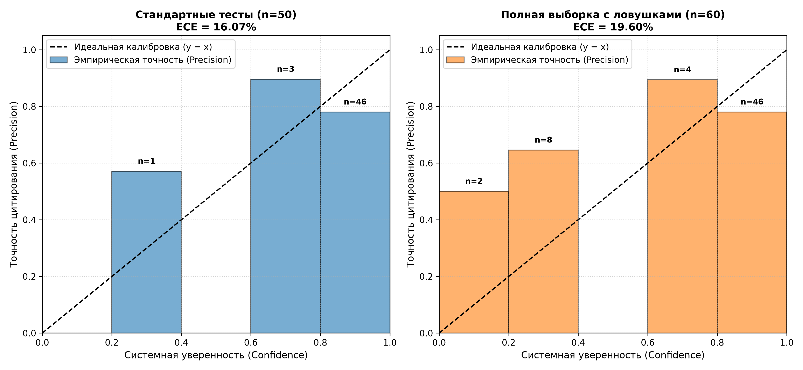

# TARO

Прототип Deep Research агента, способного выходить в открытый веб, агрегировать распределенный контекст, защищаться от когнитивных ловушек (*False Premise Traps*) и подтверждать каждое утверждение сносками на первоисточники. Качество атрибуции и калибровки верифицировано по методологии **ALCE**.

## Концепция и исследовательская база

При проектировании TARO проанализировал некоторые проблемы RAG- и Research-агентов: галлюцинации фактов, сверхуверенность и потеря источников при генерации длинного контекста.

Идеи реализации взятые из публикаций в области надежности LLM:

**ALCE Benchmark** ([Gao et al., 2023 — "Enabling Large Language Models to Generate Text with Citations"](https://arxiv.org/abs/2305.14627)):
  Принцип квантификации качества отчета через *Citation Precision* (доля ссылок, подтверждающих тезис) и *Citation Recall* (полнота покрытия тезисов сносками).

**NLI-as-a-Judge** ([*Honovich et al., 2022 — TRUE Benchmark*](https://arxiv.org/abs/2204.04991)):
  Использование логического вывода на естественном языке (*Natural Language Inference, Entailment*) вместо лексических метрик для автоматического фактчекинга цитат.

**Калибровка уверенности модели** ([*Guo et al., 2017 — "On Calibration of Modern Neural Networks"*](https://arxiv.org/abs/1706.04599)):
  Внедрение метрики *Expected Calibration Error* и построение *Reliability Diagrams* для устранения расхождения между уверенностью модели в ответе и его точностью.

**Устойчивость к ложным предпосылкам** ([*Vu et al., 2023 — FreshQA*](https://arxiv.org/abs/2310.03214)):
  Выявление вопросов с заведомо ложной информацией и штрафование уверенности системы с явным опровержением ложной предпосылки.


## Архитектура

Модульный мультиагентный принцип с асинхронным параллелизмом:

### Агентные роли

**QueryPlannerAgent**: Реализует принцип Perspective-Guided Questioning из Стэнфордской системы STORM, декомпозируя комплексный вопрос на 2–3 поисковых вектора вместо одного прямого запроса.

**ContentCollectorAgent**: Взаимодействует с поисковой инфраструктурой Keenable, собирает поисковую выдачу, дедуплицирует домены и загружает полный очищенный Markdown-контент целевых страниц.

**FactAuditorAgent**:
  * Проверяет запрос на наличие ложной предпосылки (*False Premise*).
  * Извлекает атомарные проверяемые факты с явной привязкой к идентификаторам источников.
  * Оценивает междоменный консенсус (cross-source consensus): подтверждение тезиса двумя независимыми доменами повышает его доверительный вес.

**SynthesisAndCalibrationModule**:
  * Рассчитывает объективную системную уверенность на базе 4 параметров: средней уверенности фактов, плотности цитирования, консенсуса и доменного разнообразия.
  * Синтезирует связный академический текст, где каждое предложение обязательно подкреплено маркерами цитирования [N].

*Примечание*: разделение на FactAuditorAgent и SynthesisModule устраняет Confirmation Bias по методологии Chain-of-Verification (CoVe): модель синтезирует отчет только по извлеченным фактам, а не по сырому тексту.

## Экспериментальные результаты

Для объективной проверки TARO был развернут стресс-тест на выборке из 60 сценариев:

**40** многоаспектных вопросов из бенчмарка `din0s/asqa` (комплексный поиск, требующий синтеза из разных источников).

**10** вопросов-ловушек с ложными предпосылками из `FreshQA` (проверка детектора галлюцинаций).

**10** динамических и медленно меняющихся фактов из `FreshQA`.

### Сводные метрики (LLM-as-a-Judge: Qwen-2.5-27B)

| Метрика | Значение | Описание |
| :--- | :---: | :--- |
| **Citation Precision** | **78.3%** | Доля цитат `[N]`, логически подтвержденных первоисточником (*NLI Entailment*) |
| **Citation Recall** | **96.2%** | Доля фактологических предложений отчета, обеспеченных ссылками |
| **Калибровка (Standard ECE)** | **16.07%** | Ошибка калибровки на стандартных вопросах ($n=50$) |
| **Распознавание ловушек (Traps)** | **90.0% (9/10)** | Распознавание ложной предпосылки со снижением уверенности до $\le 25\%$ |
| **Общий Calibration Pass Rate** | **80.0% (48/60)** | Доля сценариев, уложившихся в доверительный интервал надежности |

### Надежность калибровки

Скрипт `plot_calibration.py` рассчитывает ошибку калибровки (ECE) и строит диаграмму надежности:



> Значение ECE **16.07%** на стандартных тестах отражает умеренный разрыв между исходной самооценкой модели (~91.3%) и фактической NLI-точностью (~78.3%).


## Запуск

### Установка окружения

```bash
git clone <URL_РЕПОЗИТОРИЯ>
cd deep-research-agent
python3 -m venv venv
source venv/bin/activate
pip install -r requirements.txt
```

### Настройка переменных окружения

Скопируйте шаблон `.env.example` в `.env`:

```bash
cp .env.example .env
```

### Одиночный запуск

Для запуска глубокого исследования по шаблонному вопросу:

```bash
python3 dr_system.py
```

### Запуск полноценного тестирования

* **Экспресс-тест (8 сценариев):**
  ```bash
  BENCHMARK_DATASET_PATH="data/benchmark_dataset_quick.json" python3 evaluate_agent.py
  ```

* **Основной бенчмарк (60 сценариев):**
  ```bash
  python3 evaluate_agent.py
  ```

* **Отрисовка графиков Reliability Diagram и расчет ECE:**
  ```bash
  python3 plot_calibration.py
  ```


## Идеи для будущего развития

### Архитектурные и алгоритмические доработки
* **Адаптивный корректирующий цикл (Corrective RAG / ReAct):**
  Переход от линейного графа к итеративному контуру с обратной связью: если `FactAuditorAgent` выявляет дефицит данных, система динамически формирует корректирующие подзапросы и инициирует второй круг сбора.
* **Bidirectional Reflection Loop:**
Добавление этапа самокритики: генератор отчета возвращает черновик на повторный аудит *FactAuditorAgent* перед финализацией, удаляя неподтвержденные формулировки до финального вывода.
* **Арбитраж противоречий через состязательные дебаты (Adversarial Multi-Agent Debate):**
  Внедрение пары агентов (Тезис / Антитезис) для обработки спорных тем и поляризованных источников. Фиксация альтернативных точек зрения в финальном отчете.

### Поиск
* **«Time Machine Search» через Keenable `query_time`:**
  Использование исторического среза поискового индекса Keenable для анализа динамики изменения фактов во времени и исторической реконструкции консенсуса.
* **Мультимодальная верификация источников:**
Извлечение и валидация данных из PDF-отчетов, графиков и HTML-таблиц веб-страниц.

### Оптимизация инференса
* **Локальные специализированные SLM для NLI-аудита:**
  Замена вызовов внешней LLM в роли арбитра на компактные открытые модели (*Bespoke-Minicheck* / *Qwen-2.5-Coder-7B*), работающие локально с минимальной задержкой и нулевой стоимостью инференса.
